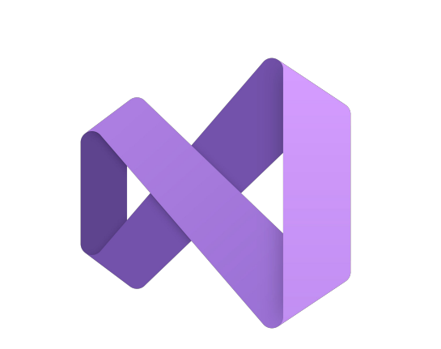
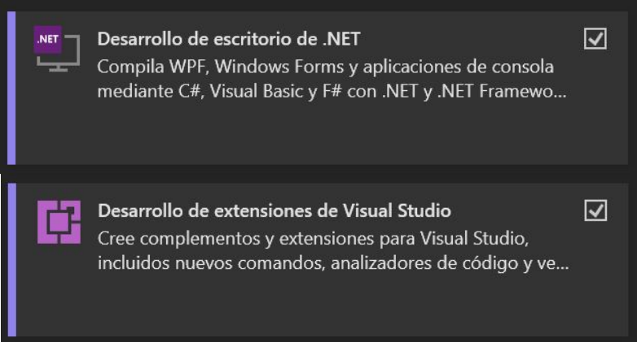
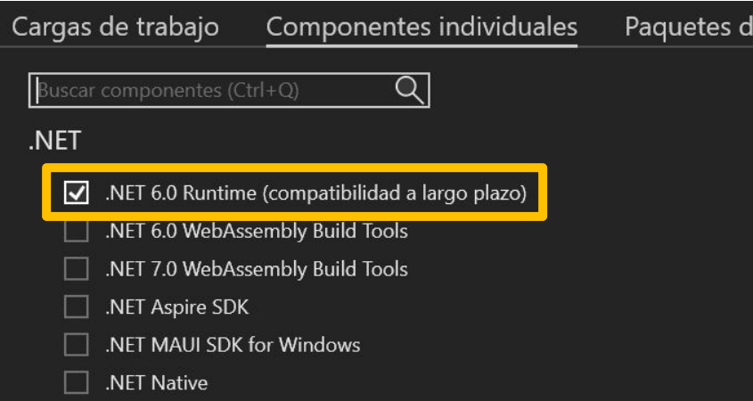
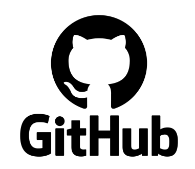
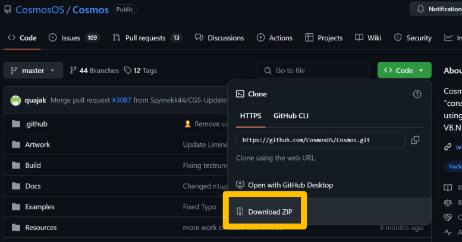
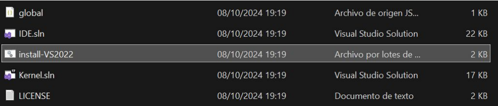
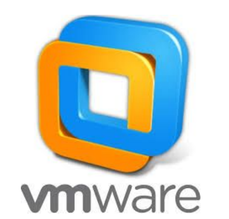

# Projecte Suna'S.O.S Cosmos
 <h1 align="center">
   
  
</h1>

## Features
|                            | Suna'S.O.S.  | ◾ Other O.S. |
| -------------------------- | :-----------------: | :---------------: |
| 0 Optimització de processos|         ✔️         |        ❌        |
| Codi Spaghetti             |         ✔️         |        ❌        |
| Bloatware                  |         ✔️         |        ❌        |
| Comandes documentades      |         ✔️         |        ❌        |
| Comandes sense configurar  |         ✔️         |        ❌        |
| Codi innecessari           |         ✔️         |        ❌        |

  <a href="#bulb-about">About-Entorn</a> &nbsp;&bull;&nbsp;
  <a href="#mag_right-research">Research</a> &nbsp;&bull;&nbsp;
  <a href="#computer">Tutorial d'instal·lació</a> &nbsp;&bull;&nbsp;</a>

Benvingut al <del>MILLOR</del> O.S. mai creat.

Aquest S.O. que desenvoluparem a M6 està presentat per en Pau Fernandez "Suna".

## :bulb: About

L'entorn per poder treballar en les marvelles de desenvolupar sistemes operatius és el Microsoft Visual Studio (enterprise).
Amés, necessitarem la versió 17.6 de VMware si no volem tenir problemes i algun mal de cap.. (els tindràs igual).
Entre d'altres dependències com el .NET framework 6..
Si has escalat el monte del destino i has pogut arribar fins aquí, felicitats. El Kernel que està en desenvolupament
es troba a la carpeta "CosmosKernelSuna", disfruta.

## :mag_right: Research

En un futur s'anirà implementant petites millores que fagin d'aquest S.O. un producte millor i més complet. 
Ara mateix no entenc molt de la materia.

## 💻 Tutorial d'instal·lació

 1-Preparació d'entorn  
 1.1-Descarreguem Visual Studio 2022 (Versió Enterprise)  
   
 1.2-Al Visual Studio cal instal·lar les extensions següents:  
  
 1.3-Cal instal.lar el .NET 6.0 Runtime (compatibilidad a largo plazo) 
  
 1.4-Descarreguem i instal.lem l'SDK de .NET 6.0  
  
 1.5-Anem al github ofical de Cosmos  
  
 1.6-Descarreguem el zip amb l'ultima versió  
  
 1.7-Cercar i executar el fitxer de la imatge. Conforme el programa ens va demanant dependències, acceptem i les instal.lem totes.  
  
 1.8-Instal.lar la versio 17.6.0 de VMWare  
 <a href="https://blogs.vmware.com/workstation/2024/05/vmware-workstation-pro-now-available-free-for-personal-use.html">
  
 </a>

